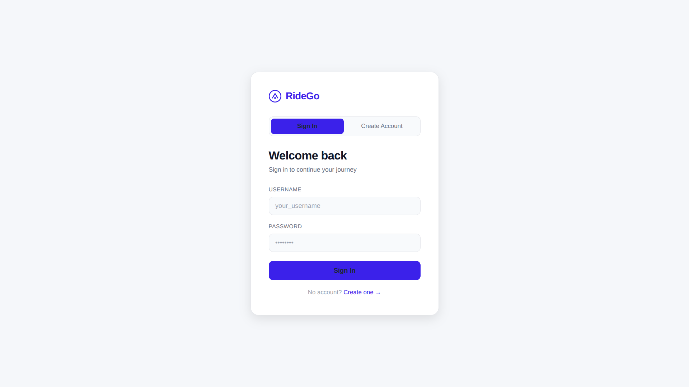
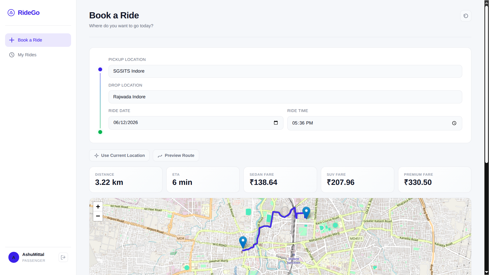
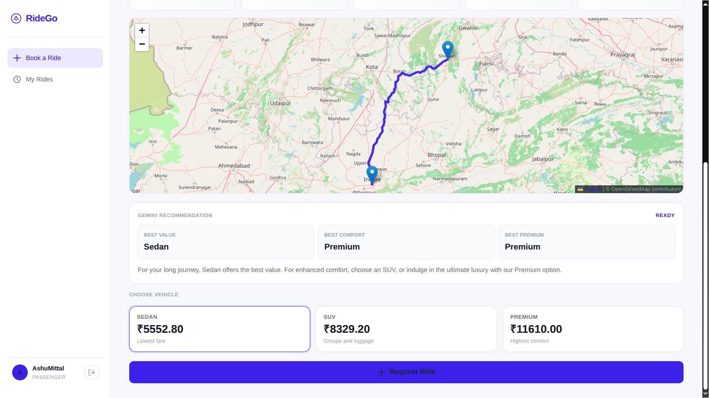
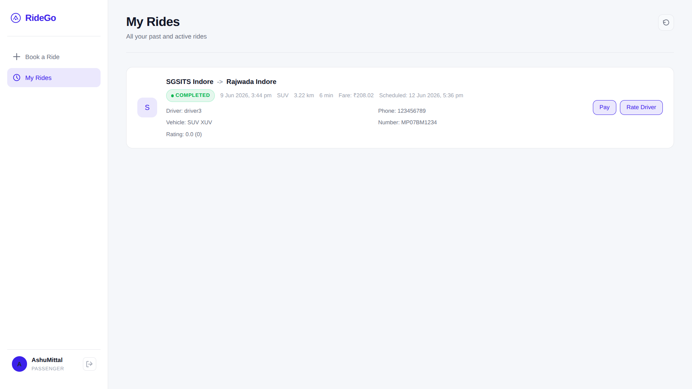
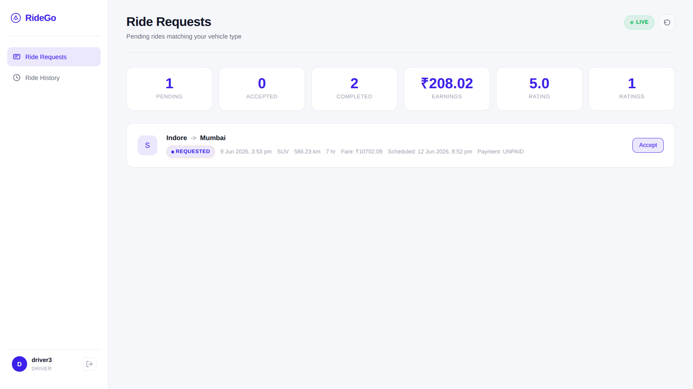

# RideGo — AI-Powered Ride Booking Platform

A full-stack ride-hailing platform built with **Java Spring Boot**, **MongoDB**, **Google Gemini AI**, **OpenRouteService**, and **Razorpay**.

RideGo provides a complete ride-booking experience including route planning, AI-powered vehicle recommendations, secure payments, ride scheduling, driver management, ratings, JWT-based authentication, and role-based access control.

---

## 🚀 Overview

RideGo demonstrates modern backend engineering practices, third-party API integrations, AI-powered recommendations, and secure payment processing in a real-world ride-booking application.

---

## ✨ Highlights

* 🔐 JWT Authentication with Role-Based Access Control (PASSENGER / DRIVER)
* 🗺️ Interactive Route Planning with Live Map Preview
* 🤖 AI-Powered Vehicle Recommendations using Google Gemini
* 💳 Razorpay Payment Integration with Verification & Webhooks
* ⭐ Driver Rating and Feedback System
* 📅 Scheduled Ride Booking
* 🚗 Vehicle-Based Pricing (Sedan, SUV, Premium)
* 🔄 Complete Ride Lifecycle Management
* 📊 Driver Dashboard with Earnings, Ratings, and Statistics

---

## 🛠️ Tech Stack

| Layer          | Technology                                |
| -------------- | ----------------------------------------- |
| Backend        | Java 17, Spring Boot 3.2, Spring Security |
| Database       | MongoDB                                   |
| Authentication | JWT (JJWT), BCrypt                        |
| AI Integration | Google Gemini API                         |
| Maps & Routing | OpenRouteService API, Leaflet.js          |
| Payments       | Razorpay                                  |
| Frontend       | HTML5, CSS3, Vanilla JavaScript (ES6+)    |
| Build Tool     | Maven                                     |
| Utilities      | Lombok                                    |

---

## 📸 Screenshots

### Login & Registration



### Route Preview with Live Map



### AI Vehicle Recommendation



### Ride History



### Razorpay Payment Flow


### Driver Dashboard



> Replace the image paths with your actual screenshot locations.

---

## 🏗️ System Architecture

```text
Frontend (HTML + CSS + JavaScript)
              │
              │ REST APIs (JWT Secured)
              ▼
      Spring Boot Backend
   ┌─────────────────────────┐
   │ Spring Security         │
   │ Ride Management         │
   │ Driver Management       │
   │ AI Recommendation       │
   │ Payment Processing      │
   └─────────────────────────┘
              │
   ┌──────────┼───────────┬───────────┐
   ▼          ▼           ▼           ▼
MongoDB   Gemini AI   OpenRouteService Razorpay
          Recommendation Maps & ETA    Payments
```

---

## 🚖 Features

### Passenger Features

* User Registration & Login
* Book Rides
* Route Preview with Live Maps
* AI-Powered Vehicle Recommendations
* Vehicle Type Selection
* Scheduled Ride Booking
* Ride History
* Driver Ratings & Feedback
* Secure Razorpay Payments

### Driver Features

* Driver Registration
* Ride Request Management
* Accept / Complete Rides
* Earnings Tracking
* Rating Overview
* Ride Statistics Dashboard

---

## ⚙️ Getting Started

### Prerequisites

Make sure you have installed:

* Java 17+
* Maven 3.8+
* MongoDB
* OpenRouteService API Key
* Google Gemini API Key
* Razorpay Test Keys

---

### Clone the Repository

```bash
git clone https://github.com/Aashuumittal/RideGo.git

cd RideGo
```

---

### Configure Environment Variables

#### Linux / macOS

```bash
export GEMINI_API_KEY=your_gemini_api_key

export ORS_API_KEY=your_openrouteservice_api_key

export RAZORPAY_KEY_ID=your_razorpay_key_id

export RAZORPAY_KEY_SECRET=your_razorpay_secret

export RAZORPAY_WEBHOOK_SECRET=your_webhook_secret
```

#### Windows (PowerShell)

```powershell
$env:GEMINI_API_KEY="your_gemini_api_key"

$env:ORS_API_KEY="your_openrouteservice_api_key"

$env:RAZORPAY_KEY_ID="your_razorpay_key_id"

$env:RAZORPAY_KEY_SECRET="your_razorpay_secret"

$env:RAZORPAY_WEBHOOK_SECRET="your_webhook_secret"
```

---

### Start MongoDB

```bash
sudo systemctl start mongod
```

---

### Run the Application

```bash
./mvnw spring-boot:run
```

Application will start at:

```text
http://localhost:9091
```

---

## 🔑 Environment Variables

| Variable                | Description              |
| ----------------------- | ------------------------ |
| GEMINI_API_KEY          | Google Gemini API Key    |
| GEMINI_MODEL            | Gemini Model Name        |
| ORS_API_KEY             | OpenRouteService API Key |
| RAZORPAY_KEY_ID         | Razorpay Public Key      |
| RAZORPAY_KEY_SECRET     | Razorpay Secret Key      |
| RAZORPAY_WEBHOOK_SECRET | Razorpay Webhook Secret  |

---

## 📡 Core API Endpoints

| Method | Endpoint                            | Description                  |
| ------ | ----------------------------------- | ---------------------------- |
| POST   | `/api/auth/register`                | Register Passenger or Driver |
| POST   | `/api/auth/login`                   | Login and Receive JWT        |
| POST   | `/api/v1/rides`                     | Create Ride Request          |
| GET    | `/api/v1/user/rides`                | Passenger Ride History       |
| POST   | `/api/v1/rides/{id}/payments/order` | Create Razorpay Order        |
| GET    | `/api/v1/driver/rides/requests`     | Get Pending Ride Requests    |
| POST   | `/api/v1/driver/rides/{id}/accept`  | Accept Ride Request          |
| GET    | `/api/v1/driver/stats`              | Driver Statistics            |
| POST   | `/api/v1/ai/recommendation`         | Generate AI Recommendation   |
| POST   | `/api/v1/routes/plan`               | Route Planning & ETA         |

---

## 🔄 Ride Lifecycle

```text
Requested
    ↓
Accepted
    ↓
Completed
    ↓
Paid
```

---

## 📚 Key Learnings

During the development of RideGo, I gained practical experience with:

* Spring Security & JWT Authentication
* REST API Design & Best Practices
* MongoDB Data Modeling
* External API Integration
* Google Gemini AI Integration
* OpenRouteService Routing & ETA Calculations
* Razorpay Payment Gateway Integration
* Role-Based Access Control (RBAC)
* Full-Stack Application Development
* Production-Ready Backend Architecture

---

## 🎯 Future Improvements

* Real-Time Driver Tracking
* WebSocket-Based Ride Updates
* Driver Location Sharing
* Ride Cancellation & Refund Handling
* Admin Dashboard
* Surge Pricing
* Notifications via Email/SMS
* Docker Deployment
* CI/CD Pipeline Integration

---

## 📄 License

This project is licensed under the MIT License.

Feel free to fork, learn from, and build upon this project.

---

## 👨‍💻 Author

**Ashu Mittal**


GitHub: https://github.com/Aashuumittal
